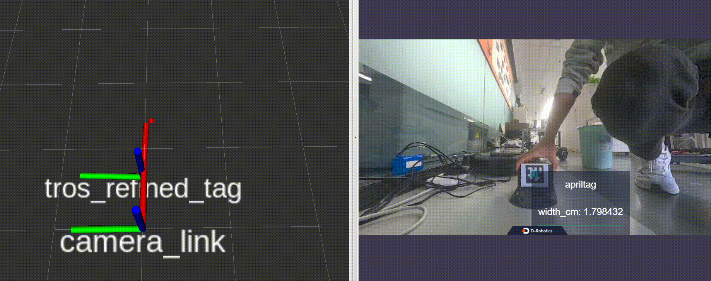
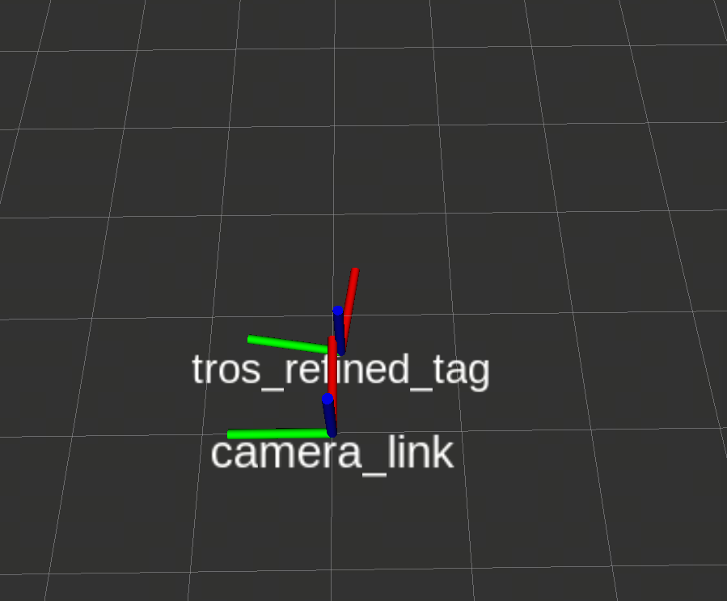
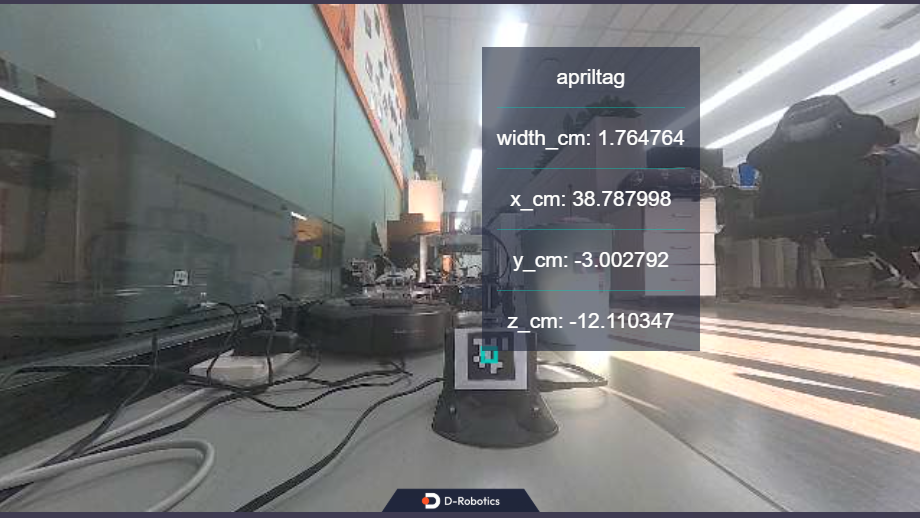

# 功能



用于在`RDK X5`平台检测二维码位姿的功能包。算法输入图像，输出二维码的位姿信息，包括坐标和yaw角、tf变换。

二维码检测使用 [apriltag](https://github.com/christianrauch/apriltag_ros.git)算法，算法支持的二维码类型详见[apriltag-imgs](https://github.com/AprilRobotics/apriltag-imgs)。同时使用深度估计数据对坐标进行校准，最终得到精确的二维码位姿。

# 安装依赖

```bash
apt update
apt install ros-humble-apriltag-msgs ros-humble-apriltag-ros ros-humble-apriltag tros-humble-ai-msgs -y
```

# 话题

## 订阅话题

| 名称         | 消息类型                             | 说明                                     |
| ------------ | ------------------------------------ | ---------------------------------------- |
| /raw_apriltag_detections | apriltag_msgs/msg/AprilTagDetectionArray          | 二维码检测算法发布的感知消息topic |
| /tros_tag_refined_position   | ai_msgs/msg/PerceptionTargets               | 使用深度估计校准二维码坐标后发布的topic             |

## 发布话题

| 名称         | 消息类型                             | 说明                                     |
| ------------ | ------------------------------------ | ---------------------------------------- |
| /tros_apriltag_detections | ai_msgs/msg/PerceptionTargets           | 将二维码感知消息转换成tros ai msg后发布的topic |
| /tros_tag_refined_pose   | geometry_msgs/msg/PoseStamped               | 校准和滤波后的二维码位姿topic             |
| /tf   | tf2_msgs/msg/TFMessage | 经过校准和滤波后发布的二维码tf        |


# 参数

| 参数名           | 含义                                                                   | 默认值                |
| ---------------- | ---------------------------- | --------------------- |
| tag_raw_det_topic          | 二维码检测算法发布的感知消息topic                | raw_apriltag_detections              |
| tros_bridged_tag_topic     | 将二维码感知消息转换成tros ai msg后发布的topic    | tros_apriltag_detections             | 
| tag_refined_position_topic | 使用深度估计校准二维码坐标后发布的topic           | tros_tag_refined_position            | 
| tag_refined_pose_topic     | 校准和滤波后的二维码位姿topic                   | tros_tag_refined_pose                  | 
| tag_raw_pose_frame         | 二维码检测算法发布的二维码tf的frame id           | tag36h11:0                            | 
| tag_refined_pose_frame     | 经过校准和滤波后发布的二维码tf的frame id         | camera_link                           | 

# 使用示例

1. 打印二维码图片

从[apriltag-imgs](https://github.com/AprilRobotics/apriltag-imgs)获取二维码图片，并使用仓库中提供的`tag_to_svg.py`工具对图片进行放大处理。

也可以使用本项目`config`路径下处理好的图片。

注意！贴二维码时需要严格按照原始图片的方向，旋转将会导致识别的二维码朝向错误。

2. 运行双目数据采集和深度估计程序

```bash
ros2 launch hobot_stereonet stereonet_model_web_visual_component_v2.1.launch.py mipi_image_width:=640 mipi_image_height:=352 mipi_rotation:=90.0 need_rectify:=False stereonet_pub_web:=False
```

3. 运行二维码识别程序

```bash
ros2 launch tros_apriltag_det bringup.launch.py
```

4. 运行`rviz`可视化

```bash
rviz2 -d `ros2 pkg prefix tros_apriltag_det --share`/config/tag.rviz
```

# 效果

rviz上显示的二维码位姿：



PC端打开网页浏览器查看显示的二维码感知结果，在浏览器输入 http://ip:8000 (图中IP为RDK的WIFI IP地址，例如192.168.1.100)，效果如下：


